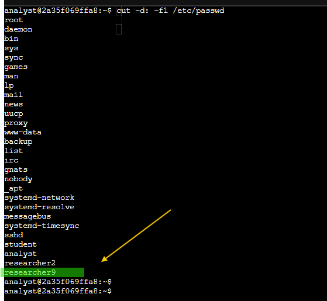

## Walkthrough  

This is a step-by-step walkthrough with the commands I used in this simulation.  

---

### **Task 1: Add a New User**  

A new employee, named `researcher9`, was hired to joined the Research department.

I created the new employee's account:
```bash
sudo useradd researcher9
```

Then I added `researcher9` to the `research_team` department group:
```bash
sudo usermod -g research_team researcher9
```


At this stage, the employee was successfully onboarded, with their account tied to the right group.


---

### **Task 2: Assign File Ownership**

The new employee was responsible for managing a project file named `project_r.txt`, located inside the `projects` directory:
```bash
sudo chown researcher9 /home/researcher2/projects/project_r.txt
```


Then, I transferred ownership of the file to ensure they had the right level of access:
```bash
cd /home/researcher2/projects
ls -l projects_r.txt
```


This gave the new employee full control of their project file without exposing other files.

---

### **Task 3: Add the User to a Secondary Group**

A few months later, the employee also started contributing to Sales projects. To handle this without affecting their Research role, I added them to a second group: `sales_team`
```bash
sudo usermod -a -G sales_team researcher9
```


Now they could access Sales resources while still keeping their Research permissions.

### **Task 4: Delete a User**

When the employee eventually left the organization, I followed offboarding best practices by cleaning up their account and associated group:

Removed the account:
```bash
sudo userdel researcher9
```

Deleted the leftover group:
```bash
sudo groupdel researcher9
```


This prevented orphaned accounts or groups. It's also an important step to reduce insider threats.

---

Lessons Learned:

This lab helped me understand the end-to-end user lifecycle management in Linux. More importantly, it connected technical commands to real-world cybersecurity principles, like:

- Least Privilege: Employees only had access to what they needed.

- Access Revocation: Accounts were fully removed when no longer needed.

- Auditability: Ownership and group membership remained clear and organized.

By working through this simulation, I gained more confidence in using Linux commands that system administrators, SOC teams, and security analysts rely on daily.

---
Thank you for staying to the End...
